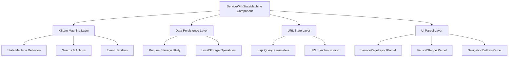
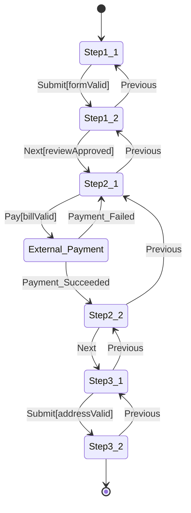

# Design Document: Service State Machine Component

## Overview

The ServiceWithStateMachine component is a React component that implements a multi-step service application workflow using XState for state management. The component integrates with Single-SPA architecture, provides data persistence through localStorage, and maintains URL synchronization while enforcing security through state validation.

The design follows a layered architecture with clear separation between state management, data persistence, UI rendering, and business logic. The component leverages existing Single-SPA parcels for consistent UI, although there are typescript interfaces and so on, it's just to illustrate the point but i expect No type-safety in this POC.

## Architecture

The component follows a modular architecture with these key layers:



### State Machine Architecture

The XState machine implements a finite state machine with 6 primary states and transition guards:



## Components and Interfaces

### Core Component Structure

```typescript
interface ServiceStateMachineProps {
  initialRequestId?: string;
  onComplete?: (requestId: string, finalData: FormData) => void;
  onError?: (error: Error, context: string) => void;
}

interface ServiceStateMachineState {
  currentStep: StepState;
  formData: FormData;
  requestId: string;
  isLoading: boolean;
  error: string | null;
}

interface StepState {
  value: 'Step1_1' | 'Step1_2' | 'Step2_1' | 'Step2_2' | 'External:Payment' | 'Step3_1' | 'Step3_2';
  context: StateMachineContext;
}
```

### State Machine Configuration

```typescript
interface StateMachineContext {
  formData: FormData;
  requestId: string;
  errors: Record<string, string>;
  validationResults: ValidationResults;
}

interface StateMachineEvents {
  type: 'Pay' | 'Next' | 'Submit' | 'Previous' | 'Payment_Failed' | 'Payment_Succeeded';
  data?: any;
}

interface Guards {
  formValid: (context: StateMachineContext) => boolean;
  reviewApproved: (context: StateMachineContext) => boolean;
  billValid: (context: StateMachineContext) => boolean;
  addressValid: (context: StateMachineContext) => boolean;
}
```

### Data Models

```typescript
interface FormData {
  step1: {
    basicInfo: BasicInfoForm;
    isSubmitted: boolean;
  };
  step2: {
    billSummary: BillSummary;
    paymentStatus: PaymentStatus;
  };
  step3: {
    shippingAddress: ShippingAddress;
    isCompleted: boolean;
  };
}

interface BasicInfoForm {
  name: string;
  email: string;
  phone: string;
  serviceType: string;
}

interface BillSummary {
  items: BillItem[];
  subtotal: number;
  tax: number;
  total: number;
}

interface ShippingAddress {
  street: string;
  city: string;
  state: string;
  zipCode: string;
  country: string;
}
```

### Parcel Integration Interfaces

```typescript
interface ServicePageLayoutParcelProps {
  title: string;
  currentStep: number;
  totalSteps: number;
  children: React.ReactNode;
}

interface VerticalStepperParcelProps {
  steps: StepDefinition[];
  currentStep: number;
  completedSteps: number[];
}

interface NavigationButtonsParcelProps {
  onPrevious?: () => void;
  onNext?: () => void;
  previousLabel?: string;
  nextLabel?: string;
  isNextDisabled?: boolean;
  isPreviousDisabled?: boolean;
}
```

## Data Models

### Request Storage Schema

The component uses a structured approach to localStorage with the following schema:

```typescript
interface StoredRequest {
  requestId: string;
  currentStep: string;
  formData: FormData;
  createdAt: string;
  updatedAt: string;
  version: string;
}

interface RequestStorageOperations {
  generateRequestId(): string;
  saveRequest(request: StoredRequest): Promise<void>;
  loadRequest(requestId: string): Promise<StoredRequest | null>;
  updateRequest(requestId: string, updates: Partial<StoredRequest>): Promise<void>;
  deleteRequest(requestId: string): Promise<void>;
}
```

### URL State Schema

```typescript
interface URLState {
  step: string;
  requestId?: string;
}

interface URLStateOperations {
  getCurrentStep(): string | null;
  setCurrentStep(step: string): void;
  getRequestId(): string | null;
  setRequestId(requestId: string): void;
  clearURLState(): void;
}
```

## Correctness Properties

*A property is a characteristic or behavior that should hold true across all valid executions of a system-essentially, a formal statement about what the system should do. Properties serve as the bridge between human-readable specifications and machine-verifiable correctness guarantees.*

Based on the prework analysis, the following correctness properties validate the system behavior:

### Property 1: State Transition Validation
*For any* state machine context with invalid form data or failed validation, attempting a state transition should maintain the current state and prevent progression to subsequent steps.
**Validates: Requirements 1.3, 1.4, 6.1**

### Property 2: Request ID Format Consistency
*For any* component initialization, the generated Request_ID should always match the format REQ-{timestamp}-{random} where timestamp is numeric and random is alphanumeric.
**Validates: Requirements 2.1**

### Property 3: Data Persistence Consistency
*For any* state transition or form data update, the current step and form data should be immediately persisted to localStorage using the Request_Storage utility.
**Validates: Requirements 2.2, 2.4**

### Property 4: URL State Synchronization
*For any* legitimate state machine transition, the URL query parameters should be updated to reflect the new state while maintaining synchronization with the state machine.
**Validates: Requirements 3.2, 3.5**

### Property 5: Security State Prioritization
*For any* conflict between URL parameters and localStorage state, the component should prioritize localStorage state and redirect unauthorized access attempts to the appropriate step.
**Validates: Requirements 3.4**

### Property 6: Parcel Props Validation
*For any* parcel integration, the component should pass props that conform to the parcel's interface requirements and handle loading states appropriately.
**Validates: Requirements 4.4, 4.5**

### Property 7: Form Validation Error Handling
*For any* form validation failure, the component should display clear error messages, prevent progression, and maintain current state until validation passes.
**Validates: Requirements 5.8, 6.4**

### Property 8: Error Recovery Mechanisms
*For any* localStorage operation failure, parcel loading failure, state machine transition failure, or network request failure, the component should handle the error gracefully, maintain system stability, and provide appropriate user feedback or retry mechanisms.
**Validates: Requirements 8.1, 8.2, 8.3, 8.4**

## Error Handling

The component implements comprehensive error handling across multiple layers:

### State Machine Error Handling
- **Guard Validation Errors**: When guards fail, the state machine maintains current state and logs validation failures
- **Transition Errors**: Invalid transitions are caught and logged without affecting component stability
- **Context Errors**: Malformed context data is validated and sanitized before state operations

### Data Persistence Error Handling
- **localStorage Failures**: When localStorage is unavailable or full, the component falls back to in-memory state management
- **Data Corruption**: Invalid stored data is detected and cleared, forcing component reinitialization
- **Serialization Errors**: JSON serialization failures are caught and handled with default values

### UI Integration Error Handling
- **Parcel Loading Failures**: Failed parcel loads display error messages with retry options
- **Prop Validation Errors**: Invalid props to parcels are caught and replaced with safe defaults
- **Rendering Errors**: React error boundaries prevent component crashes and display fallback UI

### Network Error Handling
- **Payment Processing Failures**: External payment failures trigger appropriate state transitions and user notifications
- **Validation Service Failures**: Address validation failures fall back to basic format validation
- **Timeout Handling**: Network timeouts are handled with exponential backoff retry mechanisms

## Testing Strategy

The testing approach combines unit tests for specific behaviors with property-based tests for universal correctness properties.

### Unit Testing Focus
- **Step-specific behaviors**: Test each step's unique form handling and validation logic
- **Parcel integration**: Verify correct parcel usage and prop passing
- **Error boundary behavior**: Test error boundary activation and fallback rendering
- **TypeScript interface compliance**: Verify interface definitions exist and are properly typed

### Property-Based Testing Focus
- **State machine correctness**: Test universal properties across all state transitions
- **Data persistence consistency**: Verify localStorage operations work correctly for all data types
- **URL synchronization**: Test URL/state synchronization across all legitimate transitions
- **Error handling robustness**: Test error recovery mechanisms across all failure scenarios

### Testing Configuration
- **Property test iterations**: Minimum 100 iterations per property test to ensure comprehensive coverage
- **Test tagging**: Each property test tagged with format: **Feature: service-state-machine, Property {number}: {property_text}**
- **Mock strategies**: Mock Single-SPA parcels, localStorage operations, and external payment services
- **Integration testing**: Test complete workflows from Step1_1 through Step3_2

### Test Data Generation
- **Form data generators**: Create valid and invalid form data for all steps
- **State machine generators**: Generate valid state/event combinations for transition testing
- **Error condition generators**: Create various error scenarios for robustness testing
- **Address data generators**: Generate valid and invalid address formats for validation testing

The dual testing approach ensures both specific edge cases are covered through unit tests and universal correctness properties are validated through property-based testing, providing comprehensive coverage of the component's behavior.